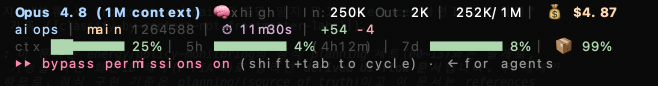
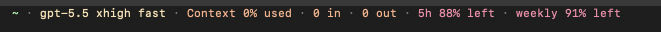

[English](./README.en.md)

# aiops - CLI 상태 바

[Claude Code](https://docs.anthropic.com/en/docs/claude-code)와 [Codex CLI](https://github.com/openai/codex)를 위한 상태 바입니다.

---

## Claude Code - 상태 바 (full / lite)



두 가지 모드와 옵션 플래그를 지원합니다.

| 옵션 | 설명 |
|------|------|
| (기본) | Full 모드 (3줄), 사용량 바 |
| `lite` | Lite 모드 (1줄) |
| `--left` | 남은 용량 바로 전환 |
| `--soft` | 파스텔 아이스크림 색상 |
| `--mask-account` | 로그인 계정 이메일을 마스킹 표시 (`ma***@gmail.com`) |

옵션은 자유롭게 조합 가능합니다: `lite --left --soft`

### Full 모드 (3줄, 기본)

```text
Opus 4.6 │ In:180K Out:54K │ 234K/200K │ $1.23
my-project │ main a1b2c3d │ ⏱ 12m30s │ +45 -12 │ 👤 you@example.com
ctx █████░░░ 58% │ 5h █████░░░ 72%(3h42m) │ 7d █████░░░ 65% │ cache 89%
```

- `1줄`: 모델, 입력/출력 토큰 수, 총 토큰/컨텍스트 크기, 세션 비용
- `2줄`: 프로젝트 폴더, git 브랜치 + 커밋 해시, 세션 시간, 변경 라인 수, 로그인 계정(👤 이메일)
- `3줄`: 사용량 바(`ctx`, `5h`, `7d`), 5시간 리셋까지 남은 시간, 프롬프트 캐시 적중률

`--left` 플래그 사용 시 3줄이 남은 용량 표시로 전환됩니다:

```text
ctx left ███░░░░░ 42% │ 5h left ██░░░░░░ 28%(3h42m) │ 7d left ██░░░░░░ 35% │ cache 89%
```

### Lite 모드 (1줄)

```text
my-project │ main │ Opus 4.6 │ 5h █████░░░ 72% │ 7d █████░░░ 65%
```

폴더, 브랜치, 모델, 5시간/7일 사용량만 보여주는 간단 모드입니다. `--left` 사용 시 남은 용량으로 전환됩니다.

### --soft (파스텔 색상)

`--soft` 플래그를 추가하면 아이스크림 파스텔 톤 색상이 적용됩니다. 트루컬러(24bit) 지원 터미널이 필요합니다.

```text
Opus 4.6 · In:180K Out:54K · 234K/200K · $1.23
my-project · main a1b2c3d · ⏱ 12m30s · +45 -12 · 👤 you@example.com
ctx █████░░░ 58% · 5h █████░░░ 72%(3h42m) · 7d █████░░░ 65% · cache 89%
```

구분자가 `│`에서 `·`로, 색상이 파스텔 톤으로 변경됩니다.

### 색상 기준

| 색상 | used (기본) | --left |
|:---:|------|------|
| 초록 | 사용량 적음 | 충분한 잔여량 |
| 노랑 | 주의 구간 | 주의 구간 |
| 빨강 | 사용량 많음, 한도 근접 | 잔여량 부족 |

### 설치

```bash
# macOS / Linux / Git Bash - Full 모드 (3줄, 기본)
curl -fsSL https://raw.githubusercontent.com/gencrewai/aiops/main/install.sh | bash

# macOS / Linux / Git Bash - Lite 모드 (1줄)
curl -fsSL https://raw.githubusercontent.com/gencrewai/aiops/main/install.sh | bash -s -- lite
```

```powershell
# Windows PowerShell - Full 모드 (3줄, 기본)
$script = Join-Path $env:TEMP 'aiops-install.ps1'
Invoke-WebRequest https://raw.githubusercontent.com/gencrewai/aiops/main/install.ps1 -OutFile $script
powershell -NoProfile -ExecutionPolicy Bypass -File $script

# Windows PowerShell - Lite 모드 (1줄)
powershell -NoProfile -ExecutionPolicy Bypass -File $script -Mode lite
```

플랫폼에 맞는 상태 바 스크립트를 `~/.claude/`에 다운로드하고 `settings.json`에 `statusLine` 설정을 추가합니다.

설치 후 Claude Code를 재시작하세요. 다른 모드로 전환하려면 설치 스크립트를 다시 실행하면 됩니다.

#### 수동 설치

**macOS / Linux / Git Bash:**

1. `claude-statusline.sh`를 `~/.claude/claude-statusline.sh`에 다운로드
2. `~/.claude/settings.json`에 추가:

```json
{
  "statusLine": {
    "type": "command",
    "command": "~/.claude/claude-statusline.sh"
  }
}
```

옵션 플래그를 추가하여 조합할 수 있습니다:

```json
{
  "statusLine": {
    "type": "command",
    "command": "~/.claude/claude-statusline.sh lite --left --soft"
  }
}
```

**Windows PowerShell:**

1. `claude-statusline.ps1`을 `~/.claude/claude-statusline.ps1`에 다운로드
2. `~/.claude/settings.json`에 추가:

```json
{
  "statusLine": {
    "type": "command",
    "command": "powershell -NoProfile -ExecutionPolicy Bypass -File C:/Users/username/.claude/claude-statusline.ps1"
  }
}
```

옵션 플래그를 추가하여 조합할 수 있습니다:

```json
{
  "statusLine": {
    "type": "command",
    "command": "powershell -NoProfile -ExecutionPolicy Bypass -File C:/Users/username/.claude/claude-statusline.ps1 lite --left --soft"
  }
}
```

### 삭제

```bash
curl -fsSL https://raw.githubusercontent.com/gencrewai/aiops/main/uninstall.sh | bash
```

```powershell
$script = Join-Path $env:TEMP 'aiops-uninstall.ps1'
Invoke-WebRequest https://raw.githubusercontent.com/gencrewai/aiops/main/uninstall.ps1 -OutFile $script
powershell -NoProfile -ExecutionPolicy Bypass -File $script
```

### 동작 방식

Claude Code는 매 턴마다 세션 메트릭이 담긴 JSON 객체를 `statusLine` 명령의 stdin으로 전달합니다. 스크립트가 JSON을 파싱하고 ANSI 이스케이프 코드로 색상 출력을 렌더링합니다.

JSON 입력에서 사용 가능한 필드:

- `model.display_name`, `context_window.context_window_size`, `context_window.used_percentage`
- `context_window.total_input_tokens`, `context_window.total_output_tokens`, `cost.total_cost_usd`
- `cost.total_duration_ms`, `cost.total_lines_added`, `cost.total_lines_removed`
- `cache_read_input_tokens`, `cache_creation_input_tokens`
- `rate_limits.five_hour.used_percentage`, `rate_limits.seven_day.used_percentage`
- `effort.level` (추론 강도, Opus 4.5+ — `high`/`medium`/`low`) — 모델명 뒤에 🧠 아이콘으로 표시
- `workspace.current_dir`, `cwd`

> **로그인 계정(👤)** 은 stdin JSON에 포함되지 않습니다. 스크립트가 `~/.claude.json`(`CLAUDE_CONFIG_DIR` 설정 시 해당 경로)의 `oauthAccount.emailAddress`를 직접 읽어 2줄 끝에 표시합니다. `--mask-account` 플래그로 마스킹(`ma***@gmail.com`)할 수 있고, 계정 정보가 없으면 생략됩니다.

### 문제 해결

- Claude Code의 user/project trust를 수락해야 `statusLine` 명령이 실행됩니다.
- `disableAllHooks`가 `true`이면 상태 바도 비활성화됩니다.
- 기존 `~/.claude/settings.json`이 유효한 JSON이어야 합니다. 이전 설치 스크립트가 텍스트를 직접 추가하여 한 줄짜리 JSON을 깨뜨릴 수 있습니다.
- `bash "~/.claude/claude-statusline.sh"`처럼 따옴표로 감싸면 `~`가 홈 디렉터리로 확장되지 않아 스크립트를 찾지 못합니다.
- 이전 버전을 설치한 경우, 설치 스크립트를 한 번 더 실행하면 `statusLine.command`가 현재 환경에 맞게 갱신됩니다.
- 최신 빌드에서는 컨텍스트 사용량을 `ctx used`, 남은 용량을 `left`로 표시하여 사용률과 잔여율을 시각적으로 구분합니다.
- 상태 스크립트는 숫자 퍼센트를 받으며, bash 산술 연산 전에 소수점을 자릅니다.
- Git Bash 없는 Windows에서는 `install.ps1`과 `claude-statusline.ps1`을 사용하세요. bash 전용 설치는 순수 PowerShell 환경에서 실행되지 않습니다.

---

## Codex CLI - 기본 상태 바



Codex CLI의 내장 상태 바를 실용적인 기본 항목으로 구성합니다.

```text
~/my-project | main | gpt-5.5 (xhigh) | ctx 18% | In 12K | Out 3K | 5h 22% | 7d 8%
```

### 표시 항목

| 항목 | 설명 |
|------|------|
| `current-dir` | 작업 디렉터리 |
| `git-branch` | 현재 git 브랜치 |
| `model-with-reasoning` | 모델명 + 추론 강도(effort, 예: `gpt-5.5 (xhigh)`) |
| `context-used` | 컨텍스트 사용률 % |
| `fast-mode` | Fast 모드 활성 표시 (⚡) |
| `total-input-tokens` | 입력 토큰 (In) |
| `total-output-tokens` | 출력 토큰 (Out) |
| `five-hour-limit` | 5시간 사용 한도 |
| `weekly-limit` | 주간 사용 한도 |

> 그 밖에 사용 가능한 컴포넌트: `project-name`, `context-remaining`, `used-tokens`, `codex-version`, `task-progress`, `thread-title`, `activity`, `run-state` 등. `codex /statusline`(인터랙티브) 또는 `~/.codex/config.toml` 직접 편집으로 조합을 바꿀 수 있습니다.

### 설치

```bash
curl -fsSL https://raw.githubusercontent.com/gencrewai/aiops/main/codex-install.sh | bash
```

`~/.codex/config.toml`에 `tui.status_line` 설정을 추가합니다. bash 환경을 전제로 합니다. Git Bash나 WSL 없는 Windows에서는 `config.toml`을 직접 편집하세요.

설치 후 Codex CLI를 재시작하세요.

#### 수동 설치

`~/.codex/config.toml`에 추가:

```toml
[tui]
status_line = ["current-dir", "git-branch", "model-with-reasoning", "context-used", "fast-mode", "total-input-tokens", "total-output-tokens", "five-hour-limit", "weekly-limit"]
status_line_use_colors = true
```

#### 인터랙티브 커스터마이즈

Codex CLI 내에서 `/statusline`을 실행하여 항목을 토글하고 순서를 변경할 수 있습니다.

### 삭제

```bash
curl -fsSL https://raw.githubusercontent.com/gencrewai/aiops/main/codex-uninstall.sh | bash
```

---

## Model/Profile Switcher - Codex / OpenCode

Codex CLI와 OpenCode의 모델, provider, 계정 alias를 프로파일로 전환합니다.

프로파일은 secret 값을 저장하지 않습니다. API 키는 환경변수나 `{file:...}` 참조로 분리하고, 스위처는 설정 파일만 갱신합니다.

### 설치

```bash
curl -fsSL https://raw.githubusercontent.com/gencrewai/aiops/main/models-install.sh | bash
```

### 사용

```bash
# 사용 가능한 프로파일
~/.aiops/aiops-models list

# Codex CLI를 표준 모델로 전환하기 전에 미리보기
~/.aiops/aiops-models use codex-standard --dry-run

# 실제 적용: ~/.codex/config.toml 백업 후 갱신
~/.aiops/aiops-models use codex-standard

# OpenCode work OpenRouter 계정 alias 적용
export OPENROUTER_WORK_API_KEY="sk-or-..."
~/.aiops/aiops-models use opencode-openrouter-work
```

### 내장 프로파일

| 프로파일 | 대상 | 용도 |
|----------|------|------|
| `codex-eco` | Codex | 저비용/일상 작업 |
| `codex-standard` | Codex | 일반 구현 작업 |
| `codex-pro` | Codex | 고난도 설계/리뷰 |
| `codex-openai-api` | Codex | `OPENAI_API_KEY` 기반 API 사용 예시 |
| `opencode-zen` | OpenCode | OpenCode 기본 Codex 계열 모델 |
| `opencode-openrouter-work` | OpenCode | 업무용 OpenRouter 계정 alias |
| `opencode-openrouter-personal` | OpenCode | 개인 OpenRouter 계정 alias |

### 변경되는 파일

| 대상 | 파일 |
|------|------|
| Codex | `~/.codex/config.toml` |
| OpenCode | `~/.config/opencode/opencode.json` 또는 기존 `opencode.jsonc` |

기존 파일이 있으면 쓰기 전에 `*.bak.YYYYMMDDTHHMMSSZ` 백업을 만듭니다. `--dry-run`은 파일을 변경하지 않고 변경 대상만 보고합니다. 프로파일 세부 내용은 `~/.aiops/aiops-models show <profile>`로 확인하세요.

### 삭제

```bash
curl -fsSL https://raw.githubusercontent.com/gencrewai/aiops/main/models-uninstall.sh | bash
```

---

## Terminal / tmux - 공통 상태 표시

Claude Code나 Codex CLI 내부가 아닌 일반 터미널 프롬프트와 tmux 상태 바에도 현재 프로젝트, git 상태, 로그인 계정(Claude)을 표시합니다.

```text
aiops my-project | main *2 | you@example.com
```

`AIOPS_MASK_ACCOUNT=1` 환경변수를 설정하면 이메일이 마스킹됩니다(`ma***@gmail.com`). 계정은 `~/.claude.json`에서 읽으며, 없으면 생략됩니다.

### 설치

```bash
curl -fsSL https://raw.githubusercontent.com/gencrewai/aiops/main/terminal-install.sh | bash
```

자동 업데이트를 켜려면 설치 시 명시적으로 옵션을 추가합니다.

```bash
curl -fsSL https://raw.githubusercontent.com/gencrewai/aiops/main/terminal-install.sh | bash -s -- --auto-update
```

설치 스크립트는 다음 작업을 수행합니다.

- `~/.aiops/terminal-statusline.sh` 설치
- `~/.aiops/terminal-update.sh` 설치
- `~/.zshrc`, `~/.bashrc`에 marker block 추가
- `~/.tmux.conf`에 `~/.aiops/tmux.conf` source block 추가
- 실행 중인 tmux 서버가 있으면 설정 즉시 reload

기존 shell/tmux 설정은 marker block 밖에서 수정하지 않습니다. 새 터미널을 열거나 `source ~/.zshrc`를 실행하면 zsh 오른쪽 프롬프트에 표시됩니다. tmux에서는 status-left 영역에 표시됩니다.

### 업데이트

기본 설치는 자동 업데이트를 켜지 않습니다. 수동 업데이트는 다음 명령으로 실행합니다.

```bash
~/.aiops/terminal-update.sh --force
```

`--auto-update`로 설치하면 새 터미널 시작 또는 tmux 설정 로드 시 하루 1번 이하로 백그라운드 업데이트를 확인합니다. 프롬프트 렌더링과 tmux status 주기 실행에서는 네트워크 요청을 하지 않습니다.

자동 업데이트를 끄려면:

```bash
curl -fsSL https://raw.githubusercontent.com/gencrewai/aiops/main/terminal-install.sh | bash -s -- --no-auto-update
```

### 삭제

```bash
curl -fsSL https://raw.githubusercontent.com/gencrewai/aiops/main/terminal-uninstall.sh | bash
```

---

## 요구사항

- **Claude Code**: `statusLine`을 지원하는 Claude Code CLI + bash(`.sh` 설치) 또는 PowerShell(Windows 설치)
- **Codex CLI**: `/statusline`을 지원하는 Codex CLI v0.1+
- **Model/Profile Switcher**: Node.js 18+
- **Terminal / tmux**: zsh 또는 bash, tmux 3.x 권장

## License

MIT
